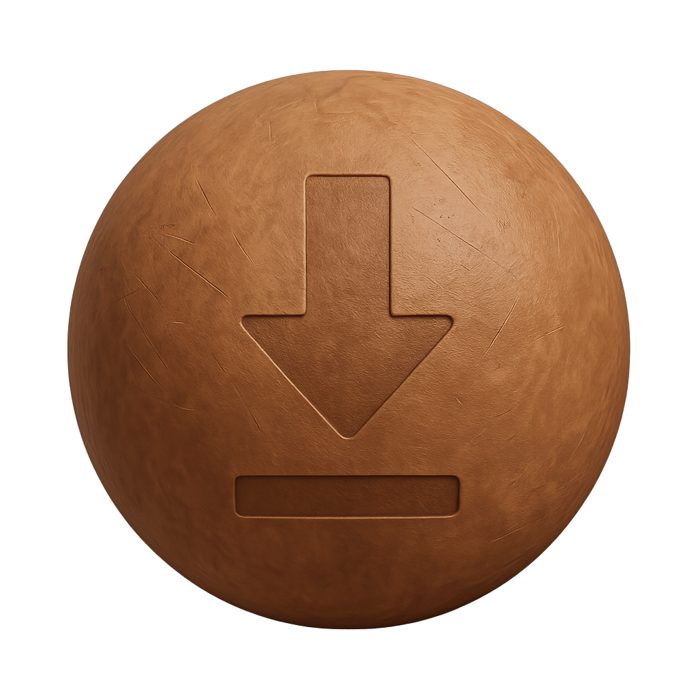

<!--Start-->

<h2 class="bg-gradient rounded-2 p-0" style="display: flex; align-items: center; gap: 10px;">
  
  <span>MaterialX Materials</span>
</h2>

<div class="container-fluid p-2 rounded-4 border border-secondary border-rounded">

<h3>Introduction</h3>

This site hosts a set of libraries and utilities to query remote databases for materials which can either be mapped to MaterialX materials or are natively stored in that format.

**Last Updated**: January, 2026 (1.39.5 in progress)


**Supported Libraries**

<div style="display: flex; align-items: center;">

<a href="https://physicallybased.info/">PhysicallyBased database</a> Material descriptions can be downloaded with additional utilities to create materials using either: Autodesk Standard Surface, OpenPBR, or glTF PBR shading model shaders.
</div>
<br>
<div style="display: flex; align-items: center;">

<a href="https://matlib.gpuopen.com/main/materials/all">AMD GPUOpen database</a> MaterialX packages can be downloaded (as zip files). Images and MaterialX documents can be extracted for any of the posted materials in the database.
</div>
<br>
<div style="display: flex; align-items: center;">

<a href="https://ambientcg.com/list?type=material&sort=popular">ambientCG database</a> MaterialX packages can be downloaded (as zip files). Images and MaterialX documents can be extracted for any of the posted materials in the database.
</div>
<br>
<div style="display: flex; align-items: center;">

<a href="https://polyhaven.com/">PolyHaven Library</a> MaterialX assets can be downloaded (as zip files). Images and MaterialX documents can be extracted for any of the posted materials in the database.
</div>

</p>
Each currently has <code>Python</code> and / or <code>Javascript</code> implementations. 

**Links**

- <a href="https://kwokcb.github.io/materialxMaterials" target="_blank">Home Page</a>
- Main tooling site: <div class="btn btn-outline-secondary"><a href="https://kwokcb.github.io/MaterialXLab" target="_blank"> MaterialXLab</a> 
- The API reference can be found <a href="https://kwokcb.github.io/materialxMaterials/documents/html/index.html">here</a>
- <a href="https://github.com/kwokcb/materialxMaterials"> GitHub repository</a>.

A `Jupyter` notebook demonstrates the direct usage of the Python library. The output of the notebook can be found <a href="https://kwokcb.github.io/materialxMaterials/examples/materialxMaterials_tutorial_out_iframe.html">here</a>. The notebook can found in the Github repository under the `examples` folder.

<h4>Examples</h4>

The following are some samples which have been rendered using the `MaterialXView` utility which is part of the MaterialX binary distribution. 

See the <a href="https://kwokcb.github.io/materialxMaterials/examples/index.html">Examples pages</a> for further details.

<table>
<tr>

<!-- 1 -->
<td>
GPUOpen
<table>
<tr >
<td >

Emerald Peaks Wallpaper
</td>
<td >

Indigo Palm Wallpaper
</td>
<td >

Oliana Blue Painted Wood
</td>
</tr>
</table>
</td>

<!-- 2 -->
<td>
<table>
PhysicallyBased
<tr >
<td >

Ketchup
</td>
<td >

Cooking Oil
</td>
<td >

Brass
</td>
</table>

<tr>
<!-- 3 -->
<td>

<table>
ambientCG
<tr>
<td>

Metal (53)
</td>
<td>

Paving Stones (142)
</td>
<td>

Wood Floor (38)
</td>
</table>

<!-- 4 -->
<td>
PolyHaven
<table>
<tr>
<td>

Ashphalt
</td>
<td >

Polystyrene
</td>
<td >

Wood Trunk Wall
</td>
</table>

</tr>
</table>

</div><p><div class="container-fluid p-2 rounded-4 border border-secondary border-rounded">

<h3>Details</h3>

<table class="p-2 container-fluid p-2 border border-outline-secondary">
<tr class="row-sm">

<td class="col-sm p-2 border border-outline-secondary">

<h4>1. PhysicallyBased</h4>

An <a href="https://kwokcb.github.io/MaterialXLab/javascript/PhysicallyBasedMaterialX_out.html" target="_blank">interactive page</a> for extracting <code>PhysicallyBased</code> uses a Javascript implementation found <a href="https://github.com/kwokcb/materialxMaterials/blob/main/javascript/JsMaterialXPhysicallyBased.js">here


</a>

</td>

<td class="col-sm p-2 border border-outline-secondary">

<h4>2. AMD GPUOpen</h4>

A command line utility is available <a href="https://github.com/kwokcb/materialxMaterials/tree/main/javascript/JsGPUOpenLoaderPackage">here</a>. This uses <code>Node.js</code> to allow access to fetch materials from the <code>GPU Open</code> site(which is not available via a web page).

<p><a href="https://github.com/kwokcb/materialxWeb/blob/main/flask/gpuopen/README.md">A <b>Flask</b> application</a> is also available which uses the Python package with a Web based front here.
<br>

</p>

</td>
<tr>

<td class="col-sm p-2 border border-outline-secondary">

<h4>3. ambientCg</h4>

A <b>NodeJS / Express</b> application can also be found on the <a href="https://kwokcb.github.io/materialxWeb/index.html" target="_blank">MaterialXWeb</a> site.

This is designed to be a general purpose MaterialX *material inspector* supporting `ambientCg` and `GPUOpen` currently with the intent to add new libraries as they become available.


</td>

<td class="col-sm p-2 border border-outline-secondary">

<h4>4. PolyHaven</h4>

A Python library and command `polyHavenLoader` and `polyHavenLoaderCmd` can be used to get a list of assets which can be downloaded in zip
format.

A Javascript library and Web interface is available <a href="https://kwokcb.github.io/materialxMaterials/javascript/JsPolyHaven/" target="__default"><b>here</b>. 

<table>
<tr>
<td></td>
<td></td>
<td></td>
</tr>
</table>
</a>

Filtering by classification, name tags, and dependent image resolution is available. Materials may be previewed and / or saved.


</td>
</td>
</table>

</div><p><div class="container-fluid p-2 rounded-4 border border-secondary border-rounded">

<h3>Visualization and Inspection</h3>

The content can be loaded into any publicly available MaterialX viewer or editor. The <a href="https://kwokcb.github.io/MaterialXLab/" target="_blank">MaterialXLab</a> site includes a Node Editor which can load materials from all four libraries directly.

<h4>MaterialXLab Node Editor</h4>
<p>
Below are screenshots of materials fetched from <code>PhysicallyBased</code>, <code>GPU Open</code>, <code>ambientCg></code> and <code>PolyHaven</code> (left to right images respectively). 

Note that the material zip from <code>GPU Open</code> and <code>ambientCg</code> is directly read into the editor via it's zip loading option. <code>PolyHaven</code> packages material content into a zip to allow loading via the zip loading option. 
<table>
<tr>
<td></td>
<td></td>
<td></td>
<td></td>
</tr>
</table>
</p>
<p>Support is also available on the MaterialXLab site for
the shader introspection, node definition publishing, and
graphing / diagramming </p>

<h4>Example Usage</h4>

<iframe
  src="https://www.youtube.com/embed/4KiPW9IUR6U?rel=0&vq=hd1080"
  title="Using Material Libraries" width="100%"
  height="600px" frameborder="0"
  allow="accelerometer; autoplay; clipboard-write; encrypted-media; gyroscope; picture-in-picture"
  allowfullscreen>
</iframe>

</div><p><div class="container-fluid p-2 rounded-4 border border-secondary border-rounded">

<h3>Library Dependencies</h3>

The Python utilities require:

1. The `MaterialX` 1.39 or greater package for PhysicallyBased OpenPBR shader creation. The current build is against 1.39.5.
2. The `requests` package.
3. The `pillow` package for image handling for GPUOpen package handling (optional)

The JavaScript utilities require:

1. `javascript/JsGPUOpenLoaderPackage`:
  - `node-fetch` (for HTTP requests)
  - `yargs` (for command line parsing)

2. `javascript/JSEXRViewer`:
  - `express` (for running the web server)

</div><p><div class="container-fluid p-2 rounded-4 border border-secondary border-rounded">

<h3>Package Building</h3>

The <a href="https://github.com/kwokcb/materialxMaterials"> GitHub repository</a> can be cloned.

The Python package can be built using:

```shell
pip install .
```

This will pull down the dependent Python packages as needed.

Build scripts can be found in the `utilities` folder.

- `build.sh` will install the package and run package commands to update package data.
- `buildDocs.sh` will prepare documents and run Doxygen to build API docs.
- `build_examples.sh` will download material examples and optionally render them. `PhysicallyBased` rendering requires `MaterialXView` to be installed.

The Javascript utilities require `Node.js` to be installed. From the package folders
the following should be run:

```shell
npm install             # Install dependent packages
npm run [build/start]   # Build distribution or run the package
```

</div><p><div class="container-fluid p-2 rounded-4 border border-secondary border-rounded">

<h3>Command Line Interfaces</h3>

<h4>Python</h4>

- Query all materials fom PhysicallyBased and convert them to all  support shading models. Save the material list and corresponding MaterialX files in the default output location. The build will include this information Python package under the <code>data</code> folder.

  ```sh
  python physicallyBasedMaterialXCmd.py
  ```
  or 

  ```sh
  materialxMaterials physbased
  ```

- Query all materials fom GPUOpen. Extract out a few material packages (zip). Save the material lists, material names and unzipped packages (MaterialX and images) in the default output location. The build will include this information Python package under the <code>data</code> folder.

  ```sh
  materialxMaterials gpuopen --materialNames=1 --saveMaterials=1
  ```

- Download the materials list fom ambientCG: 

  ```sh
  materialxMaterials acg --saveMaterials True
  ```

- Extract out a material package for the "WoodFloor038" material from ambientCG requesting the 
package where the images are 2K PNG files:

  ```sh
  materialxMaterials acg --downloadMaterial "WoodFloor038" --downloadResolution 2
  ```
- Examine all texture assets on PolyHaven, and find all ones which have MaterialX resources. Does not download the asset.

  ```sh
  polyHavenLoaderCmd.py --fetch --download_id=""
  ```

- Extract out a specific MateriaX asset with a given identifier.
  ```sh
  polyHavenLoaderCmd.py --fetch --download_id="aerial_asphalt_01"
  ```
- Extract out the first 10 MaterialX assets.
  ```sh
  polyHavenLoaderCmd.py --fetch -c 10
  ```

- Scan locally downloaded MaterialX asset information to download.

  ```sh
  python -m materialxMaterials polyhaven --load --download_id="aerial_asphalt_01"
  ```

<h5>NodeJS</h5>

The utility can be run from the `javascript\JsGPUOpenLoaderPackage` folder as follows:

```
npm start -- [<arguments>]
```
or:
```
node gpuOpenFetch.js [<arguments>]
```
with the appropriate arguments. It supports the same options as the Python utility -- namely material information, and package (zip) downloads. For the following 2 lines are equivalent to download a material called "Moss Green Solid Granite".
```
node gpuOpenFetch.js  -n "Moss Green Solid Granite"
npm start -- -n "Moss Green Solid Granite"
```

</div>
<!--End-->

