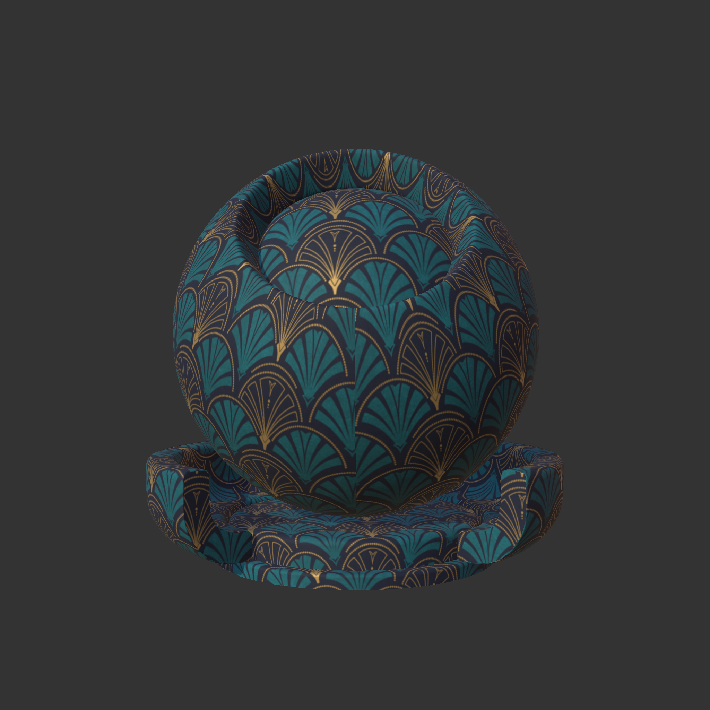

<!--Start-->
<h2 class="bg-gradient rounded-2 p-0"> MaterialX Materials Examples</h2>

<div class="container p-2 rounded-4 border border-secondary border-rounded">

### PhysicallyBased Materials

The resulting MaterialX document using the glTF PBR shader is given below:

<details>
<summary>Click to expand</summary>

```xml
<?xml version="1.0"?>
<materialx version="1.39">
  <!--Physically Based Materials from https://api.physicallybased.info -->
  <!--  Processsed via API and converted to MaterialX -->
  <!--  Target Shading Model: gltf_pbr-->
  <!--  Utility Author: Bernard Kwok. kwokcb@gmail.com -->
  <!-- Generated shader: SHD_PBM_GLTF_Aluminum -->
  <gltf_pbr name="SHD_PBM_GLTF_Aluminum" type="surfaceshader" doc="Reference: https://raw.githubusercontent.com/AntonPalmqvist/physically-based-api/main/images/renders/cycles/600/aluminum.jpeg">
    <input name="base_color" type="color3" value="0.912,0.914,0.92" />
    <input name="metallic" type="float" value="1" />
    <input name="specular_color" type="color3" value="0.97,0.979,0.988" />
    <input name="roughness" type="float" value="0" />
    <input name="ior" type="float" value="1.5" />
  </gltf_pbr>
  <!-- Generated material: MAT_PBM_GLTF_Aluminum -->
  <surfacematerial name="MAT_PBM_GLTF_Aluminum" type="material">
    <input name="surfaceshader" type="surfaceshader" nodename="SHD_PBM_GLTF_Aluminum" />
  </surfacematerial>
  <!-- Generated shader: SHD_PBM_GLTF_Banana -->
  <gltf_pbr name="SHD_PBM_GLTF_Banana" type="surfaceshader" doc="Reference: https://raw.githubusercontent.com/AntonPalmqvist/physically-based-api/main/images/renders/cycles/600/banana.jpeg">
    <input name="base_color" type="color3" value="0.634,0.532,0.111" />
    <input name="metallic" type="float" value="0" />
    <input name="roughness" type="float" value="0.5" />
    <input name="ior" type="float" value="1.5" />
  </gltf_pbr>
  <!-- Generated material: MAT_PBM_GLTF_Banana -->
  <surfacematerial name="MAT_PBM_GLTF_Banana" type="material">
    <input name="surfaceshader" type="surfaceshader" nodename="SHD_PBM_GLTF_Banana" />
  </surfacematerial>
  <!-- Generated shader: SHD_PBM_GLTF_Blackboard -->
  <gltf_pbr name="SHD_PBM_GLTF_Blackboard" type="surfaceshader" doc="Reference: https://raw.githubusercontent.com/AntonPalmqvist/physically-based-api/main/images/renders/cycles/600/blackboard.jpeg">
    <input name="base_color" type="color3" value="0.039,0.039,0.039" />
    <input name="metallic" type="float" value="0" />
    <input name="roughness" type="float" value="0.5" />
    <input name="ior" type="float" value="1.5" />
  </gltf_pbr>
  <!-- Generated material: MAT_PBM_GLTF_Blackboard -->
  <surfacematerial name="MAT_PBM_GLTF_Blackboard" type="material">
    <input name="surfaceshader" type="surfaceshader" nodename="SHD_PBM_GLTF_Blackboard" />
  </surfacematerial>
  <!-- Generated shader: SHD_PBM_GLTF_Blood -->
  <gltf_pbr name="SHD_PBM_GLTF_Blood" type="surfaceshader" doc="The color of blood depends on its oxygen level. When there is plenty of oxygen, the color is a brighter red. The reason is because of a protein called hemoglobin, which carries the oxygen in your blood. When hemoglobin has a full oxygen load, it has a bright red color, and when it's deoxygenated it's a darker red. For example, arterial and capillary blood is bright, and venous blood is dark.. Reference: https://raw.githubusercontent.com/AntonPalmqvist/physically-based-api/main/images/renders/cycles/600/blood.jpeg">
    <input name="base_color" type="color3" value="0.64448,0.003,0.005" />
    <input name="metallic" type="float" value="0" />
    <input name="roughness" type="float" value="0" />
    <input name="ior" type="float" value="1.301" />
    <input name="transmission" type="float" value="1" />
  </gltf_pbr>
  <!-- Generated material: MAT_PBM_GLTF_Blood -->
  <surfacematerial name="MAT_PBM_GLTF_Blood" type="material">
    <input name="surfaceshader" type="surfaceshader" nodename="SHD_PBM_GLTF_Blood" />
  </surfacematerial>
  <!-- Generated shader: SHD_PBM_GLTF_Bone -->
  <gltf_pbr name="SHD_PBM_GLTF_Bone" type="surfaceshader" doc="Reference: https://raw.githubusercontent.com/AntonPalmqvist/physically-based-api/main/images/renders/cycles/600/bone.jpeg">
    <input name="base_color" type="color3" value="0.793,0.793,0.664" />
    <input name="metallic" type="float" value="0" />
    <input name="roughness" type="float" value="0.5" />
    <input name="ior" type="float" value="1.5" />
  </gltf_pbr>
  <!-- Generated material: MAT_PBM_GLTF_Bone -->
  <surfacematerial name="MAT_PBM_GLTF_Bone" type="material">
    <input name="surfaceshader" type="surfaceshader" nodename="SHD_PBM_GLTF_Bone" />
  </surfacematerial>
  <!-- Generated shader: SHD_PBM_GLTF_Brass -->
  <gltf_pbr name="SHD_PBM_GLTF_Brass" type="surfaceshader" doc="Brass is an alloy of copper and zinc, with a bright and gold-like appearance. It is similar to bronze, another alloy containing copper that uses tin instead of zinc. Historically, the distinction between the two alloys has been less consistent and clear, and modern practice in museums and archaeology increasingly avoids both terms for historical objects in favor of the more general &quot;copper alloy&quot;.. Reference: https://raw.githubusercontent.com/AntonPalmqvist/physically-based-api/main/images/renders/cycles/600/brass.jpeg">
    <input name="base_color" type="color3" value="0.887,0.789,0.434" />
    <input name="metallic" type="float" value="1" />
    <input name="specular_color" type="color3" value="0.988,0.976,0.843" />
    <input name="roughness" type="float" value="0" />
    <input name="ior" type="float" value="1.5" />
  </gltf_pbr>
  <!-- Generated material: MAT_PBM_GLTF_Brass -->
  <surfacematerial name="MAT_PBM_GLTF_Brass" type="material">
    <input name="surfaceshader" type="surfaceshader" nodename="SHD_PBM_GLTF_Brass" />
  </surfacematerial>
  <!-- Generated shader: SHD_PBM_GLTF_Brick -->
  <gltf_pbr name="SHD_PBM_GLTF_Brick" type="surfaceshader" doc="Reference: https://raw.githubusercontent.com/AntonPalmqvist/physically-based-api/main/images/renders/cycles/600/brick.jpeg">
    <input name="base_color" type="color3" value="0.262,0.095,0.061" />
    <input name="metallic" type="float" value="0" />
    <input name="roughness" type="float" value="0.5" />
    <input name="ior" type="float" value="1.5" />
  </gltf_pbr>
  <!-- Generated material: MAT_PBM_GLTF_Brick -->
  <surfacematerial name="MAT_PBM_GLTF_Brick" type="material">
    <input name="surfaceshader" type="surfaceshader" nodename="SHD_PBM_GLTF_Brick" />
  </surfacematerial>
  <!-- Generated shader: SHD_PBM_GLTF_Carrot -->
  <gltf_pbr name="SHD_PBM_GLTF_Carrot" type="surfaceshader" doc="Reference: https://raw.githubusercontent.com/AntonPalmqvist/physically-based-api/main/images/renders/cycles/600/carrot.jpeg">
    <input name="base_color" type="color3" value="0.713,0.17,0.026" />
    <input name="metallic" type="float" value="0" />
    <input name="roughness" type="float" value="0.5" />
    <input name="ior" type="float" value="1.5" />
  </gltf_pbr>
  <!-- Generated material: MAT_PBM_GLTF_Carrot -->
  <surfacematerial name="MAT_PBM_GLTF_Carrot" type="material">
    <input name="surfaceshader" type="surfaceshader" nodename="SHD_PBM_GLTF_Carrot" />
  </surfacematerial>
  <!-- Generated shader: SHD_PBM_GLTF_Charcoal -->
  <gltf_pbr name="SHD_PBM_GLTF_Charcoal" type="surfaceshader" doc="Reference: https://raw.githubusercontent.com/AntonPalmqvist/physically-based-api/main/images/renders/cycles/600/charcoal.jpeg">
    <input name="base_color" type="color3" value="0.02,0.02,0.02" />
    <input name="metallic" type="float" value="0" />
    <input name="roughness" type="float" value="0.5" />
    <input name="ior" type="float" value="1.5" />
  </gltf_pbr>
  <!-- Generated material: MAT_PBM_GLTF_Charcoal -->
  <surfacematerial name="MAT_PBM_GLTF_Charcoal" type="material">
    <input name="surfaceshader" type="surfaceshader" nodename="SHD_PBM_GLTF_Charcoal" />
  </surfacematerial>
  <!-- Generated shader: SHD_PBM_GLTF_Chocolate -->
  <gltf_pbr name="SHD_PBM_GLTF_Chocolate" type="surfaceshader" doc="Reference: https://raw.githubusercontent.com/AntonPalmqvist/physically-based-api/main/images/renders/cycles/600/chocolate.jpeg">
    <input name="base_color" type="color3" value="0.162,0.091,0.06" />
    <input name="metallic" type="float" value="0" />
    <input name="roughness" type="float" value="0.5" />
    <input name="ior" type="float" value="1.5" />
  </gltf_pbr>
  <!-- Generated material: MAT_PBM_GLTF_Chocolate -->
  <surfacematerial name="MAT_PBM_GLTF_Chocolate" type="material">
    <input name="surfaceshader" type="surfaceshader" nodename="SHD_PBM_GLTF_Chocolate" />
  </surfacematerial>
  <!-- Generated shader: SHD_PBM_GLTF_Chromium -->
  <gltf_pbr name="SHD_PBM_GLTF_Chromium" type="surfaceshader" doc="Reference: https://raw.githubusercontent.com/AntonPalmqvist/physically-based-api/main/images/renders/cycles/600/chromium.jpeg">
    <input name="base_color" type="color3" value="0.638,0.651,0.663" />
    <input name="metallic" type="float" value="1" />
    <input name="specular_color" type="color3" value="0.632,0.718,0.809" />
    <input name="roughness" type="float" value="0" />
    <input name="ior" type="float" value="1.5" />
  </gltf_pbr>
  <!-- Generated material: MAT_PBM_GLTF_Chromium -->
  <surfacematerial name="MAT_PBM_GLTF_Chromium" type="material">
    <input name="surfaceshader" type="surfaceshader" nodename="SHD_PBM_GLTF_Chromium" />
  </surfacematerial>
  <!-- Generated shader: SHD_PBM_GLTF_Cobalt -->
  <gltf_pbr name="SHD_PBM_GLTF_Cobalt" type="surfaceshader" doc="Reference: https://raw.githubusercontent.com/AntonPalmqvist/physically-based-api/main/images/renders/cycles/600/cobalt.jpeg">
    <input name="base_color" type="color3" value="0.692,0.703,0.673" />
    <input name="metallic" type="float" value="1" />
    <input name="specular_color" type="color3" value="0.684,0.771,0.817" />
    <input name="roughness" type="float" value="0" />
    <input name="ior" type="float" value="1.5" />
  </gltf_pbr>
  <!-- Generated material: MAT_PBM_GLTF_Cobalt -->
  <surfacematerial name="MAT_PBM_GLTF_Cobalt" type="material">
    <input name="surfaceshader" type="surfaceshader" nodename="SHD_PBM_GLTF_Cobalt" />
  </surfacematerial>
  <!-- Generated shader: SHD_PBM_GLTF_Coffee -->
  <gltf_pbr name="SHD_PBM_GLTF_Coffee" type="surfaceshader" doc="Reference: https://raw.githubusercontent.com/AntonPalmqvist/physically-based-api/main/images/renders/cycles/600/coffee.jpeg">
    <input name="base_color" type="color3" value="0.027,0.019,0.018" />
    <input name="metallic" type="float" value="0" />
    <input name="roughness" type="float" value="0" />
    <input name="ior" type="float" value="1.33" />
  </gltf_pbr>
  <!-- Generated material: MAT_PBM_GLTF_Coffee -->
  <surfacematerial name="MAT_PBM_GLTF_Coffee" type="material">
    <input name="surfaceshader" type="surfaceshader" nodename="SHD_PBM_GLTF_Coffee" />
  </surfacematerial>
  <!-- Generated shader: SHD_PBM_GLTF_Concrete -->
  <gltf_pbr name="SHD_PBM_GLTF_Concrete" type="surfaceshader" doc="Reference: https://raw.githubusercontent.com/AntonPalmqvist/physically-based-api/main/images/renders/cycles/600/concrete.jpeg">
    <input name="base_color" type="color3" value="0.51,0.51,0.51" />
    <input name="metallic" type="float" value="0" />
    <input name="roughness" type="float" value="0.5" />
    <input name="ior" type="float" value="1.5" />
  </gltf_pbr>
  <!-- Generated material: MAT_PBM_GLTF_Concrete -->
  <surfacematerial name="MAT_PBM_GLTF_Concrete" type="material">
    <input name="surfaceshader" type="surfaceshader" nodename="SHD_PBM_GLTF_Concrete" />
  </surfacematerial>
  <!-- Generated shader: SHD_PBM_GLTF_Cooking_Oil -->
  <gltf_pbr name="SHD_PBM_GLTF_Cooking_Oil" type="surfaceshader" doc="Reference: https://raw.githubusercontent.com/AntonPalmqvist/physically-based-api/main/images/renders/cycles/600/cooking-oil.jpeg">
    <input name="base_color" type="color3" value="0.737911,0.687,0.091" />
    <input name="metallic" type="float" value="0" />
    <input name="roughness" type="float" value="0" />
    <input name="ior" type="float" value="1.47" />
    <input name="transmission" type="float" value="1" />
  </gltf_pbr>
  <!-- Generated material: MAT_PBM_GLTF_Cooking_Oil -->
  <surfacematerial name="MAT_PBM_GLTF_Cooking_Oil" type="material">
    <input name="surfaceshader" type="surfaceshader" nodename="SHD_PBM_GLTF_Cooking_Oil" />
  </surfacematerial>
  <!-- Generated shader: SHD_PBM_GLTF_Copper -->
  <gltf_pbr name="SHD_PBM_GLTF_Copper" type="surfaceshader" doc="Reference: https://raw.githubusercontent.com/AntonPalmqvist/physically-based-api/main/images/renders/cycles/600/copper.jpeg">
    <input name="base_color" type="color3" value="0.926,0.721,0.504" />
    <input name="metallic" type="float" value="1" />
    <input name="specular_color" type="color3" value="0.996,0.957,0.823" />
    <input name="roughness" type="float" value="0" />
    <input name="ior" type="float" value="1.5" />
  </gltf_pbr>
  <!-- Generated material: MAT_PBM_GLTF_Copper -->
  <surfacematerial name="MAT_PBM_GLTF_Copper" type="material">
    <input name="surfaceshader" type="surfaceshader" nodename="SHD_PBM_GLTF_Copper" />
  </surfacematerial>
  <!-- Generated shader: SHD_PBM_GLTF_Diamond -->
  <gltf_pbr name="SHD_PBM_GLTF_Diamond" type="surfaceshader" doc="Reference: https://raw.githubusercontent.com/AntonPalmqvist/physically-based-api/main/images/renders/cycles/600/diamond.jpeg">
    <input name="base_color" type="color3" value="1,1,1" />
    <input name="metallic" type="float" value="0" />
    <input name="roughness" type="float" value="0" />
    <input name="ior" type="float" value="2.4168" />
    <input name="transmission" type="float" value="1" />
  </gltf_pbr>
  <!-- Generated material: MAT_PBM_GLTF_Diamond -->
  <surfacematerial name="MAT_PBM_GLTF_Diamond" type="material">
    <input name="surfaceshader" type="surfaceshader" nodename="SHD_PBM_GLTF_Diamond" />
  </surfacematerial>
  <!-- Generated shader: SHD_PBM_GLTF_Egg_Shell -->
  <gltf_pbr name="SHD_PBM_GLTF_Egg_Shell" type="surfaceshader" doc="White hen egg from grocery store.. Reference: https://raw.githubusercontent.com/AntonPalmqvist/physically-based-api/main/images/renders/cycles/600/egg-shell.jpeg">
    <input name="base_color" type="color3" value="0.61,0.624,0.631" />
    <input name="metallic" type="float" value="0" />
    <input name="roughness" type="float" value="0.5" />
    <input name="ior" type="float" value="1.5" />
  </gltf_pbr>
  <!-- Generated material: MAT_PBM_GLTF_Egg_Shell -->
  <surfacematerial name="MAT_PBM_GLTF_Egg_Shell" type="material">
    <input name="surfaceshader" type="surfaceshader" nodename="SHD_PBM_GLTF_Egg_Shell" />
  </surfacematerial>
  <!-- Generated shader: SHD_PBM_GLTF_Eye__cornea_ -->
  <gltf_pbr name="SHD_PBM_GLTF_Eye__cornea_" type="surfaceshader" doc="Reference: https://raw.githubusercontent.com/AntonPalmqvist/physically-based-api/main/images/renders/cycles/600/eye-cornea.jpeg">
    <input name="base_color" type="color3" value="1,1,1" />
    <input name="metallic" type="float" value="0" />
    <input name="roughness" type="float" value="0" />
    <input name="ior" type="float" value="1.376" />
    <input name="transmission" type="float" value="1" />
  </gltf_pbr>
  <!-- Generated material: MAT_PBM_GLTF_Eye__cornea_ -->
  <surfacematerial name="MAT_PBM_GLTF_Eye__cornea_" type="material">
    <input name="surfaceshader" type="surfaceshader" nodename="SHD_PBM_GLTF_Eye__cornea_" />
  </surfacematerial>
  <!-- Generated shader: SHD_PBM_GLTF_Eye__lens_ -->
  <gltf_pbr name="SHD_PBM_GLTF_Eye__lens_" type="surfaceshader" doc="The refractive index of human lens varies from approximately 1.406 in the central layers down to 1.386 in less dense layers of the lens. This index gradient enhances the optical power of the lens.. Reference: https://raw.githubusercontent.com/AntonPalmqvist/physically-based-api/main/images/renders/cycles/600/eye-lens.jpeg">
    <input name="base_color" type="color3" value="1,1,1" />
    <input name="metallic" type="float" value="0" />
    <input name="roughness" type="float" value="0" />
    <input name="ior" type="float" value="1.386" />
    <input name="transmission" type="float" value="1" />
  </gltf_pbr>
  <!-- Generated material: MAT_PBM_GLTF_Eye__lens_ -->
  <surfacematerial name="MAT_PBM_GLTF_Eye__lens_" type="material">
    <input name="surfaceshader" type="surfaceshader" nodename="SHD_PBM_GLTF_Eye__lens_" />
  </surfacematerial>
  <!-- Generated shader: SHD_PBM_GLTF_Eye__sclera_ -->
  <gltf_pbr name="SHD_PBM_GLTF_Eye__sclera_" type="surfaceshader" doc="Reference: https://raw.githubusercontent.com/AntonPalmqvist/physically-based-api/main/images/renders/cycles/600/eye-sclera.jpeg">
    <input name="base_color" type="color3" value="0.68,0.49,0.37" />
    <input name="metallic" type="float" value="0" />
    <input name="roughness" type="float" value="0.5" />
    <input name="ior" type="float" value="1.4" />
  </gltf_pbr>
  <!-- Generated material: MAT_PBM_GLTF_Eye__sclera_ -->
  <surfacematerial name="MAT_PBM_GLTF_Eye__sclera_" type="material">
    <input name="surfaceshader" type="surfaceshader" nodename="SHD_PBM_GLTF_Eye__sclera_" />
  </surfacematerial>
  <!-- Generated shader: SHD_PBM_GLTF_Gasoline -->
  <gltf_pbr name="SHD_PBM_GLTF_Gasoline" type="surfaceshader" doc="Reference: https://raw.githubusercontent.com/AntonPalmqvist/physically-based-api/main/images/renders/cycles/600/gasoline.jpeg">
    <input name="base_color" type="color3" value="1,0.97,0.617" />
    <input name="metallic" type="float" value="0" />
    <input name="roughness" type="float" value="0" />
    <input name="ior" type="float" value="1.427" />
    <input name="transmission" type="float" value="1" />
  </gltf_pbr>
  <!-- Generated material: MAT_PBM_GLTF_Gasoline -->
  <surfacematerial name="MAT_PBM_GLTF_Gasoline" type="material">
    <input name="surfaceshader" type="surfaceshader" nodename="SHD_PBM_GLTF_Gasoline" />
  </surfacematerial>
  <!-- Generated shader: SHD_PBM_GLTF_Glass -->
  <gltf_pbr name="SHD_PBM_GLTF_Glass" type="surfaceshader" doc="Reference: https://raw.githubusercontent.com/AntonPalmqvist/physically-based-api/main/images/renders/cycles/600/glass.jpeg">
    <input name="base_color" type="color3" value="1,1,1" />
    <input name="metallic" type="float" value="0" />
    <input name="roughness" type="float" value="0" />
    <input name="ior" type="float" value="1.52" />
    <input name="transmission" type="float" value="1" />
  </gltf_pbr>
  <!-- Generated material: MAT_PBM_GLTF_Glass -->
  <surfacematerial name="MAT_PBM_GLTF_Glass" type="material">
    <input name="surfaceshader" type="surfaceshader" nodename="SHD_PBM_GLTF_Glass" />
  </surfacematerial>
  <!-- Generated shader: SHD_PBM_GLTF_Gold -->
  <gltf_pbr name="SHD_PBM_GLTF_Gold" type="surfaceshader" doc="Reference: https://raw.githubusercontent.com/AntonPalmqvist/physically-based-api/main/images/renders/cycles/600/gold.jpeg">
    <input name="base_color" type="color3" value="0.944,0.776,0.373" />
    <input name="metallic" type="float" value="1" />
    <input name="specular_color" type="color3" value="0.998,0.981,0.751" />
    <input name="roughness" type="float" value="0" />
    <input name="ior" type="float" value="1.5" />
  </gltf_pbr>
  <!-- Generated material: MAT_PBM_GLTF_Gold -->
  <surfacematerial name="MAT_PBM_GLTF_Gold" type="material">
    <input name="surfaceshader" type="surfaceshader" nodename="SHD_PBM_GLTF_Gold" />
  </surfacematerial>
  <!-- Generated shader: SHD_PBM_GLTF_Gray_Card -->
  <gltf_pbr name="SHD_PBM_GLTF_Gray_Card" type="surfaceshader" doc="18% gray has a perceptual lightness of 50%.. Reference: https://raw.githubusercontent.com/AntonPalmqvist/physically-based-api/main/images/renders/cycles/600/gray-card.jpeg">
    <input name="base_color" type="color3" value="0.18,0.18,0.18" />
    <input name="metallic" type="float" value="0" />
    <input name="roughness" type="float" value="0.5" />
    <input name="ior" type="float" value="1.5" />
  </gltf_pbr>
  <!-- Generated material: MAT_PBM_GLTF_Gray_Card -->
  <surfacematerial name="MAT_PBM_GLTF_Gray_Card" type="material">
    <input name="surfaceshader" type="surfaceshader" nodename="SHD_PBM_GLTF_Gray_Card" />
  </surfacematerial>
  <!-- Generated shader: SHD_PBM_GLTF_Honey -->
  <gltf_pbr name="SHD_PBM_GLTF_Honey" type="surfaceshader" doc="Variations in its water content alter its refractive index. Typically, the refractive index for honey ranges from 1.504 at 13% water content to 1.474 at 25%.. Reference: https://raw.githubusercontent.com/AntonPalmqvist/physically-based-api/main/images/renders/cycles/600/honey.jpeg">
    <input name="base_color" type="color3" value="0.83077,0.397,0.038" />
    <input name="metallic" type="float" value="0" />
    <input name="roughness" type="float" value="0" />
    <input name="ior" type="float" value="1.504" />
    <input name="transmission" type="float" value="1" />
  </gltf_pbr>
  <!-- Generated material: MAT_PBM_GLTF_Honey -->
  <surfacematerial name="MAT_PBM_GLTF_Honey" type="material">
    <input name="surfaceshader" type="surfaceshader" nodename="SHD_PBM_GLTF_Honey" />
  </surfacematerial>
  <!-- Generated shader: SHD_PBM_GLTF_Ice -->
  <gltf_pbr name="SHD_PBM_GLTF_Ice" type="surfaceshader" doc="Reference: https://raw.githubusercontent.com/AntonPalmqvist/physically-based-api/main/images/renders/cycles/600/ice.jpeg">
    <input name="base_color" type="color3" value="1,1,1" />
    <input name="metallic" type="float" value="0" />
    <input name="roughness" type="float" value="0.5" />
    <input name="ior" type="float" value="1.3098" />
    <input name="transmission" type="float" value="1" />
  </gltf_pbr>
  <!-- Generated material: MAT_PBM_GLTF_Ice -->
  <surfacematerial name="MAT_PBM_GLTF_Ice" type="material">
    <input name="surfaceshader" type="surfaceshader" nodename="SHD_PBM_GLTF_Ice" />
  </surfacematerial>
  <!-- Generated shader: SHD_PBM_GLTF_Iron -->
  <gltf_pbr name="SHD_PBM_GLTF_Iron" type="surfaceshader" doc="Reference: https://raw.githubusercontent.com/AntonPalmqvist/physically-based-api/main/images/renders/cycles/600/iron.jpeg">
    <input name="base_color" type="color3" value="0.531,0.512,0.496" />
    <input name="metallic" type="float" value="1" />
    <input name="specular_color" type="color3" value="0.571,0.54,0.586" />
    <input name="roughness" type="float" value="0" />
    <input name="ior" type="float" value="1.5" />
  </gltf_pbr>
  <!-- Generated material: MAT_PBM_GLTF_Iron -->
  <surfacematerial name="MAT_PBM_GLTF_Iron" type="material">
    <input name="surfaceshader" type="surfaceshader" nodename="SHD_PBM_GLTF_Iron" />
  </surfacematerial>
  <!-- Generated shader: SHD_PBM_GLTF_Ketchup -->
  <gltf_pbr name="SHD_PBM_GLTF_Ketchup" type="surfaceshader" doc="Reference: https://raw.githubusercontent.com/AntonPalmqvist/physically-based-api/main/images/renders/cycles/600/ketchup.jpeg">
    <input name="base_color" type="color3" value="0.164,0.006,0.002" />
    <input name="metallic" type="float" value="0" />
    <input name="roughness" type="float" value="0.1" />
    <input name="ior" type="float" value="1.3" />
  </gltf_pbr>
  <!-- Generated material: MAT_PBM_GLTF_Ketchup -->
  <surfacematerial name="MAT_PBM_GLTF_Ketchup" type="material">
    <input name="surfaceshader" type="surfaceshader" nodename="SHD_PBM_GLTF_Ketchup" />
  </surfacematerial>
  <!-- Generated shader: SHD_PBM_GLTF_Lead -->
  <gltf_pbr name="SHD_PBM_GLTF_Lead" type="surfaceshader" doc="Reference: https://raw.githubusercontent.com/AntonPalmqvist/physically-based-api/main/images/renders/cycles/600/lead.jpeg">
    <input name="base_color" type="color3" value="0.632,0.626,0.641" />
    <input name="metallic" type="float" value="1" />
    <input name="specular_color" type="color3" value="0.803,0.808,0.862" />
    <input name="roughness" type="float" value="0" />
    <input name="ior" type="float" value="1.5" />
  </gltf_pbr>
  <!-- Generated material: MAT_PBM_GLTF_Lead -->
  <surfacematerial name="MAT_PBM_GLTF_Lead" type="material">
    <input name="surfaceshader" type="surfaceshader" nodename="SHD_PBM_GLTF_Lead" />
  </surfacematerial>
  <!-- Generated shader: SHD_PBM_GLTF_Lemon -->
  <gltf_pbr name="SHD_PBM_GLTF_Lemon" type="surfaceshader" doc="Reference: https://raw.githubusercontent.com/AntonPalmqvist/physically-based-api/main/images/renders/cycles/600/lemon.jpeg">
    <input name="base_color" type="color3" value="0.718,0.483,0" />
    <input name="metallic" type="float" value="0" />
    <input name="roughness" type="float" value="0.5" />
    <input name="ior" type="float" value="1.5" />
  </gltf_pbr>
  <!-- Generated material: MAT_PBM_GLTF_Lemon -->
  <surfacematerial name="MAT_PBM_GLTF_Lemon" type="material">
    <input name="surfaceshader" type="surfaceshader" nodename="SHD_PBM_GLTF_Lemon" />
  </surfacematerial>
  <!-- Generated shader: SHD_PBM_GLTF_Marble -->
  <gltf_pbr name="SHD_PBM_GLTF_Marble" type="surfaceshader" doc="Reference: https://raw.githubusercontent.com/AntonPalmqvist/physically-based-api/main/images/renders/cycles/600/marble.jpeg">
    <input name="base_color" type="color3" value="0.83,0.791,0.753" />
    <input name="metallic" type="float" value="0" />
    <input name="roughness" type="float" value="0" />
    <input name="ior" type="float" value="1.5" />
  </gltf_pbr>
  <!-- Generated material: MAT_PBM_GLTF_Marble -->
  <surfacematerial name="MAT_PBM_GLTF_Marble" type="material">
    <input name="surfaceshader" type="surfaceshader" nodename="SHD_PBM_GLTF_Marble" />
  </surfacematerial>
  <!-- Generated shader: SHD_PBM_GLTF_Mercury -->
  <gltf_pbr name="SHD_PBM_GLTF_Mercury" type="surfaceshader" doc="Mercury is the only metallic element that is known to be liquid at standard conditions.. Reference: https://raw.githubusercontent.com/AntonPalmqvist/physically-based-api/main/images/renders/cycles/600/mercury.jpeg">
    <input name="base_color" type="color3" value="0.781,0.779,0.779" />
    <input name="metallic" type="float" value="1" />
    <input name="specular_color" type="color3" value="0.879,0.91,0.941" />
    <input name="roughness" type="float" value="0" />
    <input name="ior" type="float" value="1.5" />
  </gltf_pbr>
  <!-- Generated material: MAT_PBM_GLTF_Mercury -->
  <surfacematerial name="MAT_PBM_GLTF_Mercury" type="material">
    <input name="surfaceshader" type="surfaceshader" nodename="SHD_PBM_GLTF_Mercury" />
  </surfacematerial>
  <!-- Generated shader: SHD_PBM_GLTF_Milk -->
  <gltf_pbr name="SHD_PBM_GLTF_Milk" type="surfaceshader" doc="Cow's milk. Reference: https://raw.githubusercontent.com/AntonPalmqvist/physically-based-api/main/images/renders/cycles/600/milk.jpeg">
    <input name="base_color" type="color3" value="0.815,0.813,0.682" />
    <input name="metallic" type="float" value="0" />
    <input name="roughness" type="float" value="0" />
    <input name="ior" type="float" value="1.348" />
  </gltf_pbr>
  <!-- Generated material: MAT_PBM_GLTF_Milk -->
  <surfacematerial name="MAT_PBM_GLTF_Milk" type="material">
    <input name="surfaceshader" type="surfaceshader" nodename="SHD_PBM_GLTF_Milk" />
  </surfacematerial>
  <!-- Generated shader: SHD_PBM_GLTF_Nickel -->
  <gltf_pbr name="SHD_PBM_GLTF_Nickel" type="surfaceshader" doc="Reference: https://raw.githubusercontent.com/AntonPalmqvist/physically-based-api/main/images/renders/cycles/600/nickel.jpeg">
    <input name="base_color" type="color3" value="0.649,0.61,0.541" />
    <input name="metallic" type="float" value="1" />
    <input name="specular_color" type="color3" value="0.797,0.801,0.789" />
    <input name="roughness" type="float" value="0" />
    <input name="ior" type="float" value="1.5" />
  </gltf_pbr>
  <!-- Generated material: MAT_PBM_GLTF_Nickel -->
  <surfacematerial name="MAT_PBM_GLTF_Nickel" type="material">
    <input name="surfaceshader" type="surfaceshader" nodename="SHD_PBM_GLTF_Nickel" />
  </surfacematerial>
  <!-- Generated shader: SHD_PBM_GLTF_Office_Paper -->
  <gltf_pbr name="SHD_PBM_GLTF_Office_Paper" type="surfaceshader" doc="Office paper contains optical brightening additives that absorb light in the ultraviolet and violet region (usually 340-370 nm), and re-emit light in the blue region (typically 420-470 nm) by fluorescence.. Reference: https://raw.githubusercontent.com/AntonPalmqvist/physically-based-api/main/images/renders/cycles/600/office-paper.jpeg">
    <input name="base_color" type="color3" value="0.794,0.834,0.884" />
    <input name="metallic" type="float" value="0" />
    <input name="roughness" type="float" value="0.5" />
    <input name="ior" type="float" value="1.5" />
  </gltf_pbr>
  <!-- Generated material: MAT_PBM_GLTF_Office_Paper -->
  <surfacematerial name="MAT_PBM_GLTF_Office_Paper" type="material">
    <input name="surfaceshader" type="surfaceshader" nodename="SHD_PBM_GLTF_Office_Paper" />
  </surfacematerial>
  <!-- Generated shader: SHD_PBM_GLTF_Pearl -->
  <gltf_pbr name="SHD_PBM_GLTF_Pearl" type="surfaceshader" doc="The akoya pearl is a saltwater cultured pearl from the akoya oyster. Akoya are considered to be the classic pearl used for necklaces and other pearl jewelry. Nacre is the material of which pearls are composed and consists of aragonite crystal layers separated by conchiolin, a protein secreted by mollusk shells. The thickness of these layers determines the color of reflection from the nacre. The transmission interference color is complementary to the reflection interference color.. Reference: https://raw.githubusercontent.com/AntonPalmqvist/physically-based-api/main/images/renders/cycles/600/pearl.jpeg">
    <input name="base_color" type="color3" value="0.8,0.75,0.7" />
    <input name="metallic" type="float" value="0" />
    <input name="roughness" type="float" value="0.35" />
    <input name="ior" type="float" value="1.68" />
  </gltf_pbr>
  <!-- Generated material: MAT_PBM_GLTF_Pearl -->
  <surfacematerial name="MAT_PBM_GLTF_Pearl" type="material">
    <input name="surfaceshader" type="surfaceshader" nodename="SHD_PBM_GLTF_Pearl" />
  </surfacematerial>
  <!-- Generated shader: SHD_PBM_GLTF_Petroleum -->
  <gltf_pbr name="SHD_PBM_GLTF_Petroleum" type="surfaceshader" doc="The viscosity of crude oil is sensitive to temperature.. Reference: https://raw.githubusercontent.com/AntonPalmqvist/physically-based-api/main/images/renders/cycles/600/petroleum.jpeg">
    <input name="base_color" type="color3" value="0.03,0.027,0.024" />
    <input name="metallic" type="float" value="0" />
    <input name="roughness" type="float" value="0" />
    <input name="ior" type="float" value="1.5" />
  </gltf_pbr>
  <!-- Generated material: MAT_PBM_GLTF_Petroleum -->
  <surfacematerial name="MAT_PBM_GLTF_Petroleum" type="material">
    <input name="surfaceshader" type="surfaceshader" nodename="SHD_PBM_GLTF_Petroleum" />
  </surfacematerial>
  <!-- Generated shader: SHD_PBM_GLTF_Plastic__Acrylic_ -->
  <gltf_pbr name="SHD_PBM_GLTF_Plastic__Acrylic_" type="surfaceshader" doc="Reference: https://raw.githubusercontent.com/AntonPalmqvist/physically-based-api/main/images/renders/cycles/600/plastic-acrylic.jpeg">
    <input name="base_color" type="color3" value="1,1,1" />
    <input name="metallic" type="float" value="0" />
    <input name="roughness" type="float" value="0" />
    <input name="ior" type="float" value="1.476" />
    <input name="transmission" type="float" value="1" />
  </gltf_pbr>
  <!-- Generated material: MAT_PBM_GLTF_Plastic__Acrylic_ -->
  <surfacematerial name="MAT_PBM_GLTF_Plastic__Acrylic_" type="material">
    <input name="surfaceshader" type="surfaceshader" nodename="SHD_PBM_GLTF_Plastic__Acrylic_" />
  </surfacematerial>
  <!-- Generated shader: SHD_PBM_GLTF_Plastic__PC_ -->
  <gltf_pbr name="SHD_PBM_GLTF_Plastic__PC_" type="surfaceshader" doc="Reference: https://raw.githubusercontent.com/AntonPalmqvist/physically-based-api/main/images/renders/cycles/600/plastic-pc.jpeg">
    <input name="base_color" type="color3" value="1,1,1" />
    <input name="metallic" type="float" value="0" />
    <input name="roughness" type="float" value="0" />
    <input name="ior" type="float" value="1.5848" />
    <input name="transmission" type="float" value="1" />
  </gltf_pbr>
  <!-- Generated material: MAT_PBM_GLTF_Plastic__PC_ -->
  <surfacematerial name="MAT_PBM_GLTF_Plastic__PC_" type="material">
    <input name="surfaceshader" type="surfaceshader" nodename="SHD_PBM_GLTF_Plastic__PC_" />
  </surfacematerial>
  <!-- Generated shader: SHD_PBM_GLTF_Plastic__PET_ -->
  <gltf_pbr name="SHD_PBM_GLTF_Plastic__PET_" type="surfaceshader" doc="Reference: https://raw.githubusercontent.com/AntonPalmqvist/physically-based-api/main/images/renders/cycles/600/plastic-pet.jpeg">
    <input name="base_color" type="color3" value="1,1,1" />
    <input name="metallic" type="float" value="0" />
    <input name="roughness" type="float" value="0" />
    <input name="ior" type="float" value="1.575" />
    <input name="transmission" type="float" value="1" />
  </gltf_pbr>
  <!-- Generated material: MAT_PBM_GLTF_Plastic__PET_ -->
  <surfacematerial name="MAT_PBM_GLTF_Plastic__PET_" type="material">
    <input name="surfaceshader" type="surfaceshader" nodename="SHD_PBM_GLTF_Plastic__PET_" />
  </surfacematerial>
  <!-- Generated shader: SHD_PBM_GLTF_Plastic__PP_ -->
  <gltf_pbr name="SHD_PBM_GLTF_Plastic__PP_" type="surfaceshader" doc="Reference: https://raw.githubusercontent.com/AntonPalmqvist/physically-based-api/main/images/renders/cycles/600/plastic-pp.jpeg">
    <input name="base_color" type="color3" value="1,1,1" />
    <input name="metallic" type="float" value="0" />
    <input name="roughness" type="float" value="0" />
    <input name="ior" type="float" value="1.492" />
    <input name="transmission" type="float" value="1" />
  </gltf_pbr>
  <!-- Generated material: MAT_PBM_GLTF_Plastic__PP_ -->
  <surfacematerial name="MAT_PBM_GLTF_Plastic__PP_" type="material">
    <input name="surfaceshader" type="surfaceshader" nodename="SHD_PBM_GLTF_Plastic__PP_" />
  </surfacematerial>
  <!-- Generated shader: SHD_PBM_GLTF_Plastic__PVC_ -->
  <gltf_pbr name="SHD_PBM_GLTF_Plastic__PVC_" type="surfaceshader" doc="Reference: https://raw.githubusercontent.com/AntonPalmqvist/physically-based-api/main/images/renders/cycles/600/plastic-pvc.jpeg">
    <input name="base_color" type="color3" value="1,1,1" />
    <input name="metallic" type="float" value="0" />
    <input name="roughness" type="float" value="0" />
    <input name="ior" type="float" value="1.531" />
    <input name="transmission" type="float" value="1" />
  </gltf_pbr>
  <!-- Generated material: MAT_PBM_GLTF_Plastic__PVC_ -->
  <surfacematerial name="MAT_PBM_GLTF_Plastic__PVC_" type="material">
    <input name="surfaceshader" type="surfaceshader" nodename="SHD_PBM_GLTF_Plastic__PVC_" />
  </surfacematerial>
  <!-- Generated shader: SHD_PBM_GLTF_Platinum -->
  <gltf_pbr name="SHD_PBM_GLTF_Platinum" type="surfaceshader" doc="Reference: https://raw.githubusercontent.com/AntonPalmqvist/physically-based-api/main/images/renders/cycles/600/platinum.jpeg">
    <input name="base_color" type="color3" value="0.679,0.642,0.588" />
    <input name="metallic" type="float" value="1" />
    <input name="specular_color" type="color3" value="0.785,0.789,0.784" />
    <input name="roughness" type="float" value="0" />
    <input name="ior" type="float" value="1.5" />
  </gltf_pbr>
  <!-- Generated material: MAT_PBM_GLTF_Platinum -->
  <surfacematerial name="MAT_PBM_GLTF_Platinum" type="material">
    <input name="surfaceshader" type="surfaceshader" nodename="SHD_PBM_GLTF_Platinum" />
  </surfacematerial>
  <!-- Generated shader: SHD_PBM_GLTF_Polyurethane -->
  <gltf_pbr name="SHD_PBM_GLTF_Polyurethane" type="surfaceshader" doc="Modern car paints are nearly always an acrylic polyurethane &quot;enamel&quot; with a pigmented basecoat and a clear topcoat. It may be described as &quot;acrylic&quot;, &quot;acrylic enamel&quot;, &quot;urethane&quot;, etc. and the clearcoat in particular may be described as a lacquer.. Reference: https://raw.githubusercontent.com/AntonPalmqvist/physically-based-api/main/images/renders/cycles/600/polyurethane.jpeg">
    <input name="base_color" type="color3" value="1,1,1" />
    <input name="metallic" type="float" value="0" />
    <input name="roughness" type="float" value="0" />
    <input name="ior" type="float" value="1.6" />
    <input name="transmission" type="float" value="1" />
  </gltf_pbr>
  <!-- Generated material: MAT_PBM_GLTF_Polyurethane -->
  <surfacematerial name="MAT_PBM_GLTF_Polyurethane" type="material">
    <input name="surfaceshader" type="surfaceshader" nodename="SHD_PBM_GLTF_Polyurethane" />
  </surfacematerial>
  <!-- Generated shader: SHD_PBM_GLTF_Salt -->
  <gltf_pbr name="SHD_PBM_GLTF_Salt" type="surfaceshader" doc="Reference: https://raw.githubusercontent.com/AntonPalmqvist/physically-based-api/main/images/renders/cycles/600/salt.jpeg">
    <input name="base_color" type="color3" value="1,1,1" />
    <input name="metallic" type="float" value="0" />
    <input name="roughness" type="float" value="0.2" />
    <input name="ior" type="float" value="1.5275" />
    <input name="transmission" type="float" value="1" />
  </gltf_pbr>
  <!-- Generated material: MAT_PBM_GLTF_Salt -->
  <surfacematerial name="MAT_PBM_GLTF_Salt" type="material">
    <input name="surfaceshader" type="surfaceshader" nodename="SHD_PBM_GLTF_Salt" />
  </surfacematerial>
  <!-- Generated shader: SHD_PBM_GLTF_Sand -->
  <gltf_pbr name="SHD_PBM_GLTF_Sand" type="surfaceshader" doc="Reference: https://raw.githubusercontent.com/AntonPalmqvist/physically-based-api/main/images/renders/cycles/600/sand.jpeg">
    <input name="base_color" type="color3" value="0.44,0.386,0.23074" />
    <input name="metallic" type="float" value="0" />
    <input name="roughness" type="float" value="0.5" />
    <input name="ior" type="float" value="1.5" />
  </gltf_pbr>
  <!-- Generated material: MAT_PBM_GLTF_Sand -->
  <surfacematerial name="MAT_PBM_GLTF_Sand" type="material">
    <input name="surfaceshader" type="surfaceshader" nodename="SHD_PBM_GLTF_Sand" />
  </surfacematerial>
  <!-- Generated shader: SHD_PBM_GLTF_Sapphire -->
  <gltf_pbr name="SHD_PBM_GLTF_Sapphire" type="surfaceshader" doc="Reference: https://raw.githubusercontent.com/AntonPalmqvist/physically-based-api/main/images/renders/cycles/600/sapphire.jpeg">
    <input name="base_color" type="color3" value="0.67,0.764,0.855" />
    <input name="metallic" type="float" value="0" />
    <input name="roughness" type="float" value="0" />
    <input name="ior" type="float" value="1.7682" />
    <input name="transmission" type="float" value="1" />
  </gltf_pbr>
  <!-- Generated material: MAT_PBM_GLTF_Sapphire -->
  <surfacematerial name="MAT_PBM_GLTF_Sapphire" type="material">
    <input name="surfaceshader" type="surfaceshader" nodename="SHD_PBM_GLTF_Sapphire" />
  </surfacematerial>
  <!-- Generated shader: SHD_PBM_GLTF_Silicon -->
  <gltf_pbr name="SHD_PBM_GLTF_Silicon" type="surfaceshader" doc="Reference: https://raw.githubusercontent.com/AntonPalmqvist/physically-based-api/main/images/renders/cycles/600/silicon.jpeg">
    <input name="base_color" type="color3" value="0.344,0.367,0.419" />
    <input name="metallic" type="float" value="1" />
    <input name="roughness" type="float" value="0" />
    <input name="ior" type="float" value="1.5" />
  </gltf_pbr>
  <!-- Generated material: MAT_PBM_GLTF_Silicon -->
  <surfacematerial name="MAT_PBM_GLTF_Silicon" type="material">
    <input name="surfaceshader" type="surfaceshader" nodename="SHD_PBM_GLTF_Silicon" />
  </surfacematerial>
  <!-- Generated shader: SHD_PBM_GLTF_Silver -->
  <gltf_pbr name="SHD_PBM_GLTF_Silver" type="surfaceshader" doc="Reference: https://raw.githubusercontent.com/AntonPalmqvist/physically-based-api/main/images/renders/cycles/600/silver.jpeg">
    <input name="base_color" type="color3" value="0.962,0.949,0.922" />
    <input name="metallic" type="float" value="1" />
    <input name="specular_color" type="color3" value="0.999,0.998,0.998" />
    <input name="roughness" type="float" value="0" />
    <input name="ior" type="float" value="1.5" />
  </gltf_pbr>
  <!-- Generated material: MAT_PBM_GLTF_Silver -->
  <surfacematerial name="MAT_PBM_GLTF_Silver" type="material">
    <input name="surfaceshader" type="surfaceshader" nodename="SHD_PBM_GLTF_Silver" />
  </surfacematerial>
  <!-- Generated shader: SHD_PBM_GLTF_Skin_I -->
  <gltf_pbr name="SHD_PBM_GLTF_Skin_I" type="surfaceshader" doc="Reference: https://raw.githubusercontent.com/AntonPalmqvist/physically-based-api/main/images/renders/cycles/600/skin-i.jpeg">
    <input name="base_color" type="color3" value="0.847,0.638,0.552" />
    <input name="metallic" type="float" value="0" />
    <input name="roughness" type="float" value="0.5" />
    <input name="ior" type="float" value="1.4" />
  </gltf_pbr>
  <!-- Generated material: MAT_PBM_GLTF_Skin_I -->
  <surfacematerial name="MAT_PBM_GLTF_Skin_I" type="material">
    <input name="surfaceshader" type="surfaceshader" nodename="SHD_PBM_GLTF_Skin_I" />
  </surfacematerial>
  <!-- Generated shader: SHD_PBM_GLTF_Skin_II -->
  <gltf_pbr name="SHD_PBM_GLTF_Skin_II" type="surfaceshader" doc="Reference: https://raw.githubusercontent.com/AntonPalmqvist/physically-based-api/main/images/renders/cycles/600/skin-ii.jpeg">
    <input name="base_color" type="color3" value="0.799,0.485,0.347" />
    <input name="metallic" type="float" value="0" />
    <input name="roughness" type="float" value="0.5" />
    <input name="ior" type="float" value="1.4" />
  </gltf_pbr>
  <!-- Generated material: MAT_PBM_GLTF_Skin_II -->
  <surfacematerial name="MAT_PBM_GLTF_Skin_II" type="material">
    <input name="surfaceshader" type="surfaceshader" nodename="SHD_PBM_GLTF_Skin_II" />
  </surfacematerial>
  <!-- Generated shader: SHD_PBM_GLTF_Skin_III -->
  <gltf_pbr name="SHD_PBM_GLTF_Skin_III" type="surfaceshader" doc="Reference: https://raw.githubusercontent.com/AntonPalmqvist/physically-based-api/main/images/renders/cycles/600/skin-iii.jpeg">
    <input name="base_color" type="color3" value="0.623,0.433,0.343" />
    <input name="metallic" type="float" value="0" />
    <input name="roughness" type="float" value="0.5" />
    <input name="ior" type="float" value="1.4" />
  </gltf_pbr>
  <!-- Generated material: MAT_PBM_GLTF_Skin_III -->
  <surfacematerial name="MAT_PBM_GLTF_Skin_III" type="material">
    <input name="surfaceshader" type="surfaceshader" nodename="SHD_PBM_GLTF_Skin_III" />
  </surfacematerial>
  <!-- Generated shader: SHD_PBM_GLTF_Skin_IV -->
  <gltf_pbr name="SHD_PBM_GLTF_Skin_IV" type="surfaceshader" doc="Reference: https://raw.githubusercontent.com/AntonPalmqvist/physically-based-api/main/images/renders/cycles/600/skin-iv.jpeg">
    <input name="base_color" type="color3" value="0.436,0.227,0.131" />
    <input name="metallic" type="float" value="0" />
    <input name="roughness" type="float" value="0.5" />
    <input name="ior" type="float" value="1.4" />
  </gltf_pbr>
  <!-- Generated material: MAT_PBM_GLTF_Skin_IV -->
  <surfacematerial name="MAT_PBM_GLTF_Skin_IV" type="material">
    <input name="surfaceshader" type="surfaceshader" nodename="SHD_PBM_GLTF_Skin_IV" />
  </surfacematerial>
  <!-- Generated shader: SHD_PBM_GLTF_Skin_V -->
  <gltf_pbr name="SHD_PBM_GLTF_Skin_V" type="surfaceshader" doc="Reference: https://raw.githubusercontent.com/AntonPalmqvist/physically-based-api/main/images/renders/cycles/600/skin-v.jpeg">
    <input name="base_color" type="color3" value="0.283,0.148,0.079" />
    <input name="metallic" type="float" value="0" />
    <input name="roughness" type="float" value="0.5" />
    <input name="ior" type="float" value="1.4" />
  </gltf_pbr>
  <!-- Generated material: MAT_PBM_GLTF_Skin_V -->
  <surfacematerial name="MAT_PBM_GLTF_Skin_V" type="material">
    <input name="surfaceshader" type="surfaceshader" nodename="SHD_PBM_GLTF_Skin_V" />
  </surfacematerial>
  <!-- Generated shader: SHD_PBM_GLTF_Skin_VI -->
  <gltf_pbr name="SHD_PBM_GLTF_Skin_VI" type="surfaceshader" doc="Reference: https://raw.githubusercontent.com/AntonPalmqvist/physically-based-api/main/images/renders/cycles/600/skin-vi.jpeg">
    <input name="base_color" type="color3" value="0.09,0.05,0.02" />
    <input name="metallic" type="float" value="0" />
    <input name="roughness" type="float" value="0.5" />
    <input name="ior" type="float" value="1.4" />
  </gltf_pbr>
  <!-- Generated material: MAT_PBM_GLTF_Skin_VI -->
  <surfacematerial name="MAT_PBM_GLTF_Skin_VI" type="material">
    <input name="surfaceshader" type="surfaceshader" nodename="SHD_PBM_GLTF_Skin_VI" />
  </surfacematerial>
  <!-- Generated shader: SHD_PBM_GLTF_Snow -->
  <gltf_pbr name="SHD_PBM_GLTF_Snow" type="surfaceshader" doc="Reference: https://raw.githubusercontent.com/AntonPalmqvist/physically-based-api/main/images/renders/cycles/600/snow.jpeg">
    <input name="base_color" type="color3" value="0.85,0.85,0.85" />
    <input name="metallic" type="float" value="0" />
    <input name="roughness" type="float" value="0.5" />
    <input name="ior" type="float" value="1.3098" />
  </gltf_pbr>
  <!-- Generated material: MAT_PBM_GLTF_Snow -->
  <surfacematerial name="MAT_PBM_GLTF_Snow" type="material">
    <input name="surfaceshader" type="surfaceshader" nodename="SHD_PBM_GLTF_Snow" />
  </surfacematerial>
  <!-- Generated shader: SHD_PBM_GLTF_Soap_Bubble -->
  <gltf_pbr name="SHD_PBM_GLTF_Soap_Bubble" type="surfaceshader" doc="The colors of a soap bubble are the result of an interaction between the light reflected from the front and back surfaces of the soap film, a phenomenon known as thin-film interference. The thickness of a soap bubble can range between 10 nm and 1000 nm. It's thinner at the top due to gravity.. Reference: https://raw.githubusercontent.com/AntonPalmqvist/physically-based-api/main/images/renders/cycles/600/soap-bubble.jpeg">
    <input name="base_color" type="color3" value="1,1,1" />
    <input name="metallic" type="float" value="0" />
    <input name="roughness" type="float" value="0" />
    <input name="ior" type="float" value="1" />
    <input name="transmission" type="float" value="1" />
  </gltf_pbr>
  <!-- Generated material: MAT_PBM_GLTF_Soap_Bubble -->
  <surfacematerial name="MAT_PBM_GLTF_Soap_Bubble" type="material">
    <input name="surfaceshader" type="surfaceshader" nodename="SHD_PBM_GLTF_Soap_Bubble" />
  </surfacematerial>
  <!-- Generated shader: SHD_PBM_GLTF_Tire -->
  <gltf_pbr name="SHD_PBM_GLTF_Tire" type="surfaceshader" doc="Car tire.. Reference: https://raw.githubusercontent.com/AntonPalmqvist/physically-based-api/main/images/renders/cycles/600/tire.jpeg">
    <input name="base_color" type="color3" value="0.023,0.023,0.023" />
    <input name="metallic" type="float" value="0" />
    <input name="roughness" type="float" value="0.5" />
    <input name="ior" type="float" value="1.5" />
  </gltf_pbr>
  <!-- Generated material: MAT_PBM_GLTF_Tire -->
  <surfacematerial name="MAT_PBM_GLTF_Tire" type="material">
    <input name="surfaceshader" type="surfaceshader" nodename="SHD_PBM_GLTF_Tire" />
  </surfacematerial>
  <!-- Generated shader: SHD_PBM_GLTF_Titanium -->
  <gltf_pbr name="SHD_PBM_GLTF_Titanium" type="surfaceshader" doc="Reference: https://raw.githubusercontent.com/AntonPalmqvist/physically-based-api/main/images/renders/cycles/600/titanium.jpeg">
    <input name="base_color" type="color3" value="0.616,0.582,0.544" />
    <input name="metallic" type="float" value="1" />
    <input name="specular_color" type="color3" value="0.689,0.683,0.689" />
    <input name="roughness" type="float" value="0" />
    <input name="ior" type="float" value="1.5" />
  </gltf_pbr>
  <!-- Generated material: MAT_PBM_GLTF_Titanium -->
  <surfacematerial name="MAT_PBM_GLTF_Titanium" type="material">
    <input name="surfaceshader" type="surfaceshader" nodename="SHD_PBM_GLTF_Titanium" />
  </surfacematerial>
  <!-- Generated shader: SHD_PBM_GLTF_Tungsten -->
  <gltf_pbr name="SHD_PBM_GLTF_Tungsten" type="surfaceshader" doc="Reference: https://raw.githubusercontent.com/AntonPalmqvist/physically-based-api/main/images/renders/cycles/600/tungsten.jpeg">
    <input name="base_color" type="color3" value="0.504,0.498,0.478" />
    <input name="metallic" type="float" value="1" />
    <input name="specular_color" type="color3" value="0.403,0.418,0.423" />
    <input name="roughness" type="float" value="0" />
    <input name="ior" type="float" value="1.5" />
  </gltf_pbr>
  <!-- Generated material: MAT_PBM_GLTF_Tungsten -->
  <surfacematerial name="MAT_PBM_GLTF_Tungsten" type="material">
    <input name="surfaceshader" type="surfaceshader" nodename="SHD_PBM_GLTF_Tungsten" />
  </surfacematerial>
  <!-- Generated shader: SHD_PBM_GLTF_Vanadium -->
  <gltf_pbr name="SHD_PBM_GLTF_Vanadium" type="surfaceshader" doc="Reference: https://raw.githubusercontent.com/AntonPalmqvist/physically-based-api/main/images/renders/cycles/600/vanadium.jpeg">
    <input name="base_color" type="color3" value="0.52,0.532,0.541" />
    <input name="metallic" type="float" value="1" />
    <input name="specular_color" type="color3" value="0.402,0.447,0.395" />
    <input name="roughness" type="float" value="0" />
    <input name="ior" type="float" value="1.5" />
  </gltf_pbr>
  <!-- Generated material: MAT_PBM_GLTF_Vanadium -->
  <surfacematerial name="MAT_PBM_GLTF_Vanadium" type="material">
    <input name="surfaceshader" type="surfaceshader" nodename="SHD_PBM_GLTF_Vanadium" />
  </surfacematerial>
  <!-- Generated shader: SHD_PBM_GLTF_Water -->
  <gltf_pbr name="SHD_PBM_GLTF_Water" type="surfaceshader" doc="While relatively small quantities of water appear to be colorless, pure water has a slight blue color that becomes deeper as the thickness of the observed sample increases. The hue of water is an intrinsic property and is caused by selective absorption and scattering of white light. Dissolved elements or suspended impurities may give water a different color.. Reference: https://raw.githubusercontent.com/AntonPalmqvist/physically-based-api/main/images/renders/cycles/600/water.jpeg">
    <input name="base_color" type="color3" value="1,1,1" />
    <input name="metallic" type="float" value="0" />
    <input name="roughness" type="float" value="0" />
    <input name="ior" type="float" value="1.3325" />
    <input name="transmission" type="float" value="1" />
  </gltf_pbr>
  <!-- Generated material: MAT_PBM_GLTF_Water -->
  <surfacematerial name="MAT_PBM_GLTF_Water" type="material">
    <input name="surfaceshader" type="surfaceshader" nodename="SHD_PBM_GLTF_Water" />
  </surfacematerial>
  <!-- Generated shader: SHD_PBM_GLTF_Whiteboard -->
  <gltf_pbr name="SHD_PBM_GLTF_Whiteboard" type="surfaceshader" doc="Reference: https://raw.githubusercontent.com/AntonPalmqvist/physically-based-api/main/images/renders/cycles/600/whiteboard.jpeg">
    <input name="base_color" type="color3" value="0.869,0.867,0.771" />
    <input name="metallic" type="float" value="0" />
    <input name="roughness" type="float" value="0" />
    <input name="ior" type="float" value="1.5" />
  </gltf_pbr>
  <!-- Generated material: MAT_PBM_GLTF_Whiteboard -->
  <surfacematerial name="MAT_PBM_GLTF_Whiteboard" type="material">
    <input name="surfaceshader" type="surfaceshader" nodename="SHD_PBM_GLTF_Whiteboard" />
  </surfacematerial>
  <!-- Generated shader: SHD_PBM_GLTF_Zinc -->
  <gltf_pbr name="SHD_PBM_GLTF_Zinc" type="surfaceshader" doc="Reference: https://raw.githubusercontent.com/AntonPalmqvist/physically-based-api/main/images/renders/cycles/600/zinc.jpeg">
    <input name="base_color" type="color3" value="0.802,0.844,0.863" />
    <input name="metallic" type="float" value="1" />
    <input name="specular_color" type="color3" value="0.817,0.922,0.964" />
    <input name="roughness" type="float" value="0" />
    <input name="ior" type="float" value="1.5" />
  </gltf_pbr>
  <!-- Generated material: MAT_PBM_GLTF_Zinc -->
  <surfacematerial name="MAT_PBM_GLTF_Zinc" type="material">
    <input name="surfaceshader" type="surfaceshader" nodename="SHD_PBM_GLTF_Zinc" />
  </surfacematerial>
</materialx>
```
</details>
<p>

The results have been converted to glTF format and shown below:

```sh
python -m materialxgltf mtlx2gltf --translateShaders True --bakeTextures False --packageBinary True --bakeResolution 1024 --gltfGeomFileName shaderball.gltf PhysicallyBasedMaterialX_GLTF.mtlx --primsPerMaterial 1
```

<table class="container" id="phys_container">
<tr class="row">
<td class="col" id="phys_view_container" style="min-height: 320px">
<model-viewer
    class="rounded-2"
    style="background-color: rgba(21, 21, 21, 0); width: 100%; height: 100%" id="viewer1" ar
    disable-pan disable-tap camera-controls touch-action="pan-y"
    src="./PhysicallyBasedMaterialX_GLTF.mtlx.glb"
    environment-image="rural_crossroads_1k.hdr" alt="glTF model viewer" poster="https://kwokcb.github.io/materialxMaterials/examples/PhysicallyBasedMaterialX_GLTF.mtlx.glb.png"
    exposure="1.0" shadow-softness="0.5" shadow-intensity="0.7"
    skybox-image="rural_crossroads_1k.hdr">
</model-viewer>
</td>
</tr>
</table>

### Sample GPUOpen Material

This is a sample material package downloaded from AMD GPUOpen.

The package entry is as follows (at time of writing):

<details>
<summary>Click to expand</summary>

```json
{
    "author": "AMD",
    "category": "ea4a268a-cfd8-4cfe-bae1-9a68180b9a83",
    "created_date": "2023-04-19T23:07:10.660548Z",
    "description": null,
    "favorite": false,
    "id": "0dc3d4af-569e-4cde-98af-15968255779e",
    "license": "MIT Public Domain",
    "material_type": "Static",
    "mtlx_filename": "Indigo_Palm_Wallpaper.mtlx",
    "mtlx_material_name": "Indigo_Palm_Wallpaper",
    "notification_status": "None",
    "packages": [
        "cda6c347-8e03-4658-8382-dda9522dbf47",
        "c27f961d-7518-4a51-ba05-ae52e420c854",
        "6e8a8129-b385-4c7c-a336-83946a18ed24",
        "946b9db6-029a-498c-b413-dc1c89d2802c",
        "295d1331-0893-463f-8b66-f79d0bb5d45b",
        "ca741d1a-893d-4a2a-9320-d67612f0de84"
    ],
    "published_date": "2023-04-19T23:07:16.472490Z",
    "renders": [
        "f2433aa7-3b9e-4877-a373-0a9908f8f36f",
        "ad805c00-b0b9-40f7-9b38-f2ec388ee830",
        "a693e33f-985b-437c-97be-f2482645fe84"
    ],
    "renders_order": [
        "a693e33f-985b-437c-97be-f2482645fe84",
        "ad805c00-b0b9-40f7-9b38-f2ec388ee830",
        "f2433aa7-3b9e-4877-a373-0a9908f8f36f"
    ],
    "status": "Published",
    "tags": [
        "1d60459c-7259-4a61-93da-0939ae46a366",
        "fdd7f527-f5a7-42bc-a628-d8fb6cd58878",
        "de9dbea5-9257-4d2c-bfb2-cc48427ca96a",
        "d387f1c9-ee50-491b-a83d-920dfa6be92a",
        "24ce006c-8974-4fcd-a04c-d27d55d4e5a2",
        "810341a1-be03-408e-891e-54f2a91eb17f"
    ],
    "title": "Indigo Palm Wallpaper",
    "updated_date": "2023-08-07T07:29:48.059203Z",
    "viewer_enabled": true,
    "viewer_package": "6e8a8129-b385-4c7c-a336-83946a18ed24"
}
```        
</details>
<p>

The extracted MaterialX file looks like this:

<details>
<summary>Click to expand</summary>

```xml
<?xml version="1.0"?>
<materialx version="1.38" xmlns:xi="http://www.w3.org/2001/XInclude">
  <nodegraph name="NG_Indigo_Palm_Wallpaper">
    <constant name="RoughnessMin" type="float">
      <input name="value" type="float" value="0.25" />
    </constant>
    <constant name="UVScale" type="float">
      <input name="value" type="float" value="2.0" />
    </constant>
    <output name="base_color_output" type="color3" nodename="node_image_color3_2" />
    <output name="specular_roughness_output" type="float" nodename="RoughnessLevels" />
	<output name="specular_metalness_output" type="float" nodename="MetalnessExtract"/>
    <normal name="onthefly_4" type="vector3">
      <input name="space" type="string" value="world" />
    </normal>
    <output name="coat_normal_output" type="vector3" nodename="onthefly_4" />
    <output name="normal_output" type="vector3" nodename="node_normals" />
    <tangent name="onthefly_6" type="vector3">
      <input name="space" type="string" value="world" />
    </tangent>
    <output name="tangent_output" type="vector3" nodename="onthefly_6" />
    <constant name="RoughnessMax" type="float">
      <input name="value" type="float" value="1.0" />
    </constant>
    <texcoord name="node_texcoord_vector2_8" type="vector2">
      <input name="index" type="integer" value="0" />
    </texcoord>
    <multiply name="node_multiply_9" type="vector2">
      <input name="in1" type="vector2" nodename="node_texcoord_vector2_8" />
      <input name="in2" type="float" nodename="UVScale" />
    </multiply>
    <image name="node_image_vector3_10" type="vector3" GLSLFX_usage="normal" expose="true">
      <input name="texcoord" type="vector2" nodename="node_multiply_9" />
      <input name="file" type="filename" value="textures/Indigo_Palm_Wallpaper_Normal.png" />
      <input name="layer" type="string" value="" />
      <input name="default" type="vector3" value=" 0.000000, 0.000000, 0.000000" />
      <input name="uaddressmode" type="string" value="periodic" />
      <input name="vaddressmode" type="string" value="periodic" />
      <input name="filtertype" type="string" value="linear" />
      <input name="framerange" type="string" value="" />
      <input name="frameoffset" type="integer" value="0" />
      <input name="frameendaction" type="string" value="constant" />
    </image>
    <mix name="RoughnessLevels" type="float">
      <input name="fg" type="float" nodename="RoughnessMax" />
      <input name="bg" type="float" nodename="RoughnessMin" />
      <input name="mix" type="float" nodename="RoughnessExtract" />
    </mix>
    <normalmap name="node_normals" type="vector3">
      <input name="in" type="vector3" nodename="node_image_vector3_10" />
    </normalmap>
    <image name="node_image_color3_2" type="color3" GLSLFX_usage="baseColor" expose="true">
      <input name="texcoord" type="vector2" nodename="node_multiply_9" />
      <input name="file" type="filename" colorspace="srgb_texture" value="textures/Indigo_Palm_Wallpaper_baseColor.png" />
      <input name="layer" type="string" value="" />
      <input name="default" type="color3" value=" 0.000000, 0.000000, 0.000000" />
      <input name="uaddressmode" type="string" value="periodic" />
      <input name="vaddressmode" type="string" value="periodic" />
      <input name="filtertype" type="string" value="linear" />
      <input name="framerange" type="string" value="" />
      <input name="frameoffset" type="integer" value="0" />
      <input name="frameendaction" type="string" value="constant" />
    </image>
    <image name="node_image_vector3_12" type="vector3" GLSLFX_usage="roughness" expose="true">
      <input name="texcoord" type="vector2" nodename="node_multiply_9" />
      <input name="file" type="filename" value="textures/Indigo_Palm_Wallpaper_ORM.png" />
      <input name="layer" type="string" value="" />
      <input name="default" type="vector3" value=" 0.000000, 0.000000, 0.000000" />
      <input name="uaddressmode" type="string" value="periodic" />
      <input name="vaddressmode" type="string" value="periodic" />
      <input name="filtertype" type="string" value="linear" />
      <input name="framerange" type="string" value="" />
      <input name="frameoffset" type="integer" value="0" />
      <input name="frameendaction" type="string" value="constant" />
    </image>
    <extract name="RoughnessExtract" type="float">
      <input name="in" type="vector3" nodename="node_image_vector3_12" />
      <input name="index" type="integer" value="1" />
    </extract>
	<extract name="MetalnessExtract" type="float">
      <input name="in" type="vector3" nodename="node_image_vector3_12" />
      <input name="index" type="integer" value="2" />
    </extract>
  </nodegraph>
  <standard_surface name="SR_Indigo_Palm_Wallpaper" type="surfaceshader">
    <input name="base" type="float" value="0.800000011920929" />
    <input name="base_color" type="color3" output="base_color_output" nodegraph="NG_Indigo_Palm_Wallpaper" />
    <input name="diffuse_roughness" type="float" value="0.0" />
    <input name="metalness" type="float" output="specular_metalness_output" nodegraph="NG_Indigo_Palm_Wallpaper" />
    <input name="specular" type="float" value="1.0" />
    <input name="specular_color" type="color3" value=" 1.000000, 1.000000, 1.000000" />
    <input name="specular_roughness" type="float" output="specular_roughness_output" nodegraph="NG_Indigo_Palm_Wallpaper" />
    <input name="specular_IOR" type="float" value="1.5" />
    <input name="specular_anisotropy" type="float" value="0.0" />
    <input name="specular_rotation" type="float" value="0.0" />
    <input name="transmission" type="float" value="0.0" />
    <input name="transmission_color" type="color3" value=" 1.000000, 1.000000, 1.000000" />
    <input name="transmission_depth" type="float" value="0.0" />
    <input name="transmission_scatter" type="color3" value=" 0.000000, 0.000000, 0.000000" />
    <input name="transmission_scatter_anisotropy" type="float" value="0.0" />
    <input name="transmission_dispersion" type="float" value="0.0" />
    <input name="transmission_extra_roughness" type="float" value="0.0" />
    <input name="subsurface" type="float" value="0.0" />
    <input name="subsurface_color" type="color3" value=" 1.000000, 1.000000, 1.000000" />
    <input name="subsurface_radius" type="color3" value=" 1.000000, 1.000000, 1.000000" />
    <input name="subsurface_scale" type="float" value="1.0" />
    <input name="subsurface_anisotropy" type="float" value="0.0" />
    <input name="sheen" type="float" value="0.0" />
    <input name="sheen_color" type="color3" value=" 1.000000, 1.000000, 1.000000" />
    <input name="sheen_roughness" type="float" value="0.30000001192092896" />
    <input name="coat" type="float" value="0.0" />
    <input name="coat_color" type="color3" value=" 1.000000, 1.000000, 1.000000" />
    <input name="coat_roughness" type="float" value="0.10000000149011612" />
    <input name="coat_anisotropy" type="float" value="0.0" />
    <input name="coat_rotation" type="float" value="0.0" />
    <input name="coat_IOR" type="float" value="1.5" />
    <input name="coat_normal" type="vector3" output="coat_normal_output" nodegraph="NG_Indigo_Palm_Wallpaper" />
    <input name="coat_affect_color" type="float" value="0.0" />
    <input name="coat_affect_roughness" type="float" value="0.0" />
    <input name="thin_film_thickness" type="float" value="0.0" />
    <input name="thin_film_IOR" type="float" value="1.5" />
    <input name="emission" type="float" value="0.0" />
    <input name="emission_color" type="color3" value=" 1.000000, 1.000000, 1.000000" />
    <input name="opacity" type="color3" value=" 1.000000, 1.000000, 1.000000" />
    <input name="thin_walled" type="boolean" value="false" />
    <input name="normal" type="vector3" output="normal_output" nodegraph="NG_Indigo_Palm_Wallpaper" />
    <input name="tangent" type="vector3" output="tangent_output" nodegraph="NG_Indigo_Palm_Wallpaper" />
  </standard_surface>
  <surfacematerial name="Indigo_Palm_Wallpaper" type="material">
    <input name="surfaceshader" type="surfaceshader" nodename="SR_Indigo_Palm_Wallpaper" />
  </surfacematerial>
</materialx>
```
</details>
<p>

The MaterialX file and resources can directly be loaded into any application / integration that can accept MaterialX file.
The following image was produced by loading into the `MaterialXView` application.

<table class="container" id="table_container">
<tr class="row">
<th class="col">MaterialXView Image
<th class="col">glTF model-viewer
</tr>  
<tr class="row">
<td class="col">

<td class="col" id="viewer_container">
<model-viewer
    class="rounded-2"
    style="background-color: rgba(21, 21, 21, 0); width: 100%; height: 100%" id="viewer2" ar
    disable-pan disable-tap camera-controls touch-action="pan-y"
    src="./Indigo_Palm_Wallpaper.mtlx.glb" shadow-intensity="0.5"
    poster="https://kwokcb.github.io/materialxMaterials/examples/Indigo_Palm_Wallpaper_glb.png"
    environment-image="rural_crossroads_1k.hdr" alt="glTF model viewer" poster=""
    exposure="1.0" shadow-softness="0.5" shadow-intensity="0.7"
    skybox-image="">
</model-viewer>
</table>

Additionally the package has been converted to glTF format using the `materialx2gltf` Python package availbe from PyPi.

The command below will convert from an Autodesk standard surface shader to a glTF PBR shader, bake upstream graphs and then create a binary file using an input shaderball geometry. 
```sh
python -m materialxgltf mtlx2gltf Indigo_Palm_Wallpaper.mtlx --translateShaders True --bakeTextures True --packageBinary True --bakeResolution 1024 --gltfGeomFileName shaderball.gltf
```

This can be used in any gltF viewer. As a simple example, this is using the `Filament` viewer inside of Visual Studio Code.


</div>

<script type="module" src="https://unpkg.com/@google/model-viewer/dist/model-viewer.js">    
  </script>  

<script>
  // Monitor size changes in container id="viewer_container"
  const observer = new ResizeObserver(entries => {
    for (let entry of entries) {
      const cr = entry.contentRect;
      console.log(entry.target, 'cr.width', cr.width);
      console.log(entry.target, 'cr.height', cr.height);
    }
  });
  //observer.observe(document.getElementById("viewer_container"));
  observer.observe(document.getElementById("phys_container"));

</script>

  <!--End-->